# 

# 中速磁浮交通系统运行仿真平台

搭建web端中速磁浮交通系统仿真平台，用户自定义配置磁浮系统、地铁系统、高铁系统、轻轨系统的车辆编组数目、最大运行速度等配置，线路坡度角、区间限速等配置，对其运行过程做仿真计算以及可视化分析。

# 操作手册

1. 项目链接：https://github.com/yuyu-423/suspensionSimulationPlatform/tree/master
2. 登录系统链接：https://yuyu-423.github.io/suspensionSimulationPlatform/build/

系统界面下图所示。

***图1***

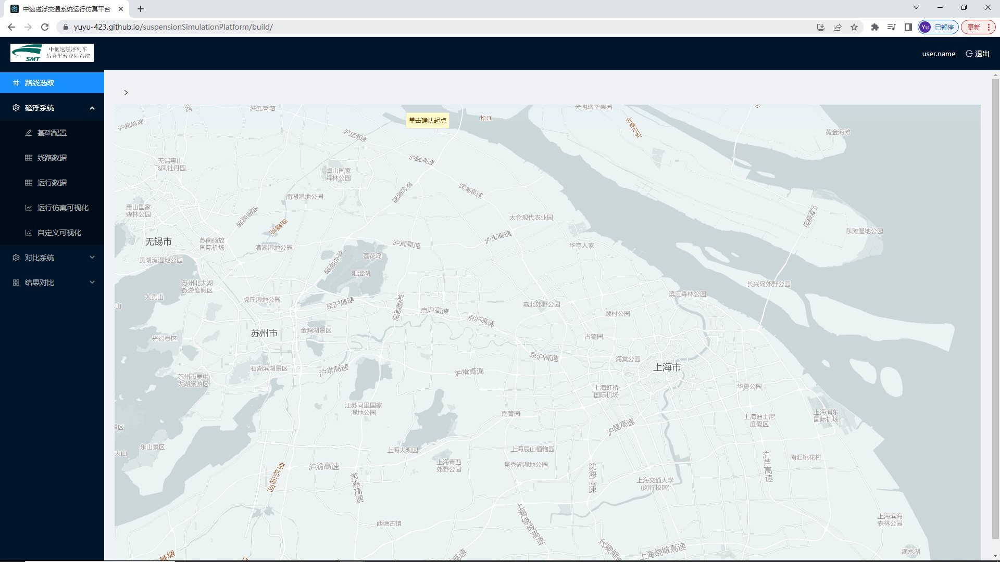

3. 点击下面链接获取仿真线路数据（demo），数据（仅支持json文件）需要满足下面代码块中各个字段。线路经纬度地理坐标系为百度坐标系。

获取数据链接：https://github.com/yuyu-423/suspensionSimulationPlatform/tree/master/demodata

```json
{
"type": "FeatureCollection",
"features": [
{ "type": "Feature", "properties": { "stationnames": "龙阳路", "linename": "地铁16号线(龙阳路-滴水湖)", "lon": 121.55342284678402, "lat": 31.204160884026471, "line": "地铁16号线", "id": 1.0, "index": 0, "stationid": 0, "location": 0.0 }, "geometry": { "type": "Point", "coordinates": [ 121.553422846784017, 31.204160884026471 ] } },
{ "type": "Feature", "properties": { "stationnames": "华夏中路", "linename": "地铁16号线(龙阳路-滴水湖)", "lon": 121.57898333494985, "lat": 31.1778997699077, "line": "地铁16号线", "id": 2.0, "index": 0, "stationid": 1, "location": 5.1432396397579359 }, "geometry": { "type": "Point", "coordinates": [ 121.578983334949854, 31.1778997699077 ] } },
]
}
```

## 线路选取界面

1. 在线路选取界面本仿真平台提供上传本地线路信息和在线编辑线路两种功能选择，仿真平台默认为在线编辑线路模式。

------

2. 操作过程如图2所示，点击路线选取界面左上角的“>”符号即可展开上传本地线路信息和在线编辑按钮（再次点击即可隐藏）

***图2***

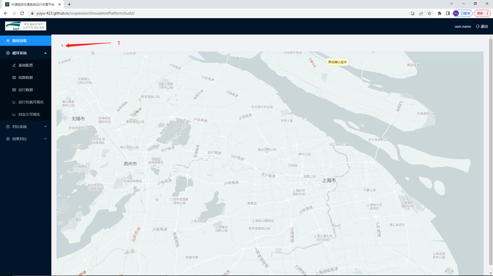

此时即弹出“上传线路”和“绘制路线”两个按钮，如图3所示，

***图3***

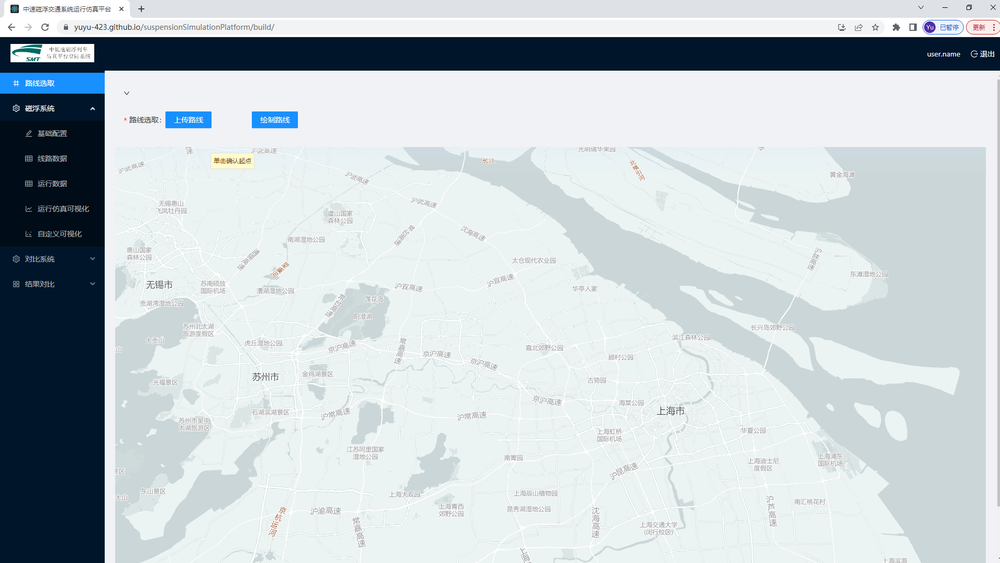

------

3. 点击绘制路线即可在下方地图中在线自定义中速磁浮交通系统的路线信息，绘制方式为鼠标左键单击选择一个点即为路线第一个点，后鼠标左键单击再次选择一个点即为线路第二个点，以此类推，直至操作者选择线路最后一个点，鼠标左键双击即可完成线路绘制，具体绘制情况如图4所示。

   在图4中白色填充方格为在线绘制地图时鼠标所选择点，未填充放个为两次鼠标所选点的中点，此外，若操作者针对整条线路不满意，可以点击图4中的红色“X”将本次绘图取消，若操作者针对整条线路局部走向不满意，可以通过鼠标左键拖动图4中方格（填充与未填充均可）的形式将线路进行局部微调，在满意后点击图4中绿色“√”即可完成在线绘图。

***图4***

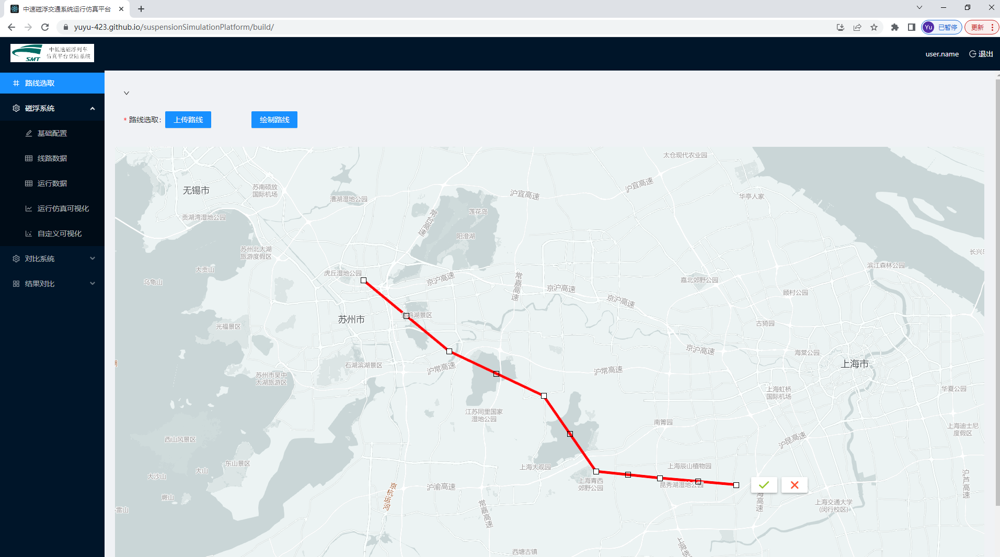

------

4. 点击图3中的上传路线，即可出现图5界面，系统默认有一条局部线路，此时操作者可以通过图5（1，2，3步骤操作）中的点击上传按钮进行路线上传

***图5***

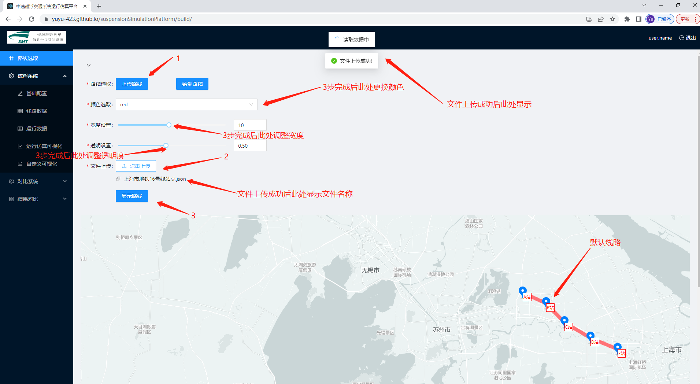

***本系统仅支持json格式文件并且数据大小小于2M的文件上传，且json格式文件中需要满足上文提及格式才能够完成线路信息的读取。***

在图5中，文件上传以后，点击显示路线按钮即可将上传数据显示在下方地图中，如图6所示。仿真平台默认显示颜色为红色，点击颜色选取下拉框可以更改线路显示颜色，仿真平台提供35种颜色选取；滑动宽度设置与透明度设置进度条，即可更改图5中路线显示的宽度于透明度，宽度区间为1至20，步长为1，仿真平台默认为10，透明度区间为0.1至1，步长为0.01，仿真平台默认为0.5。

***图6***

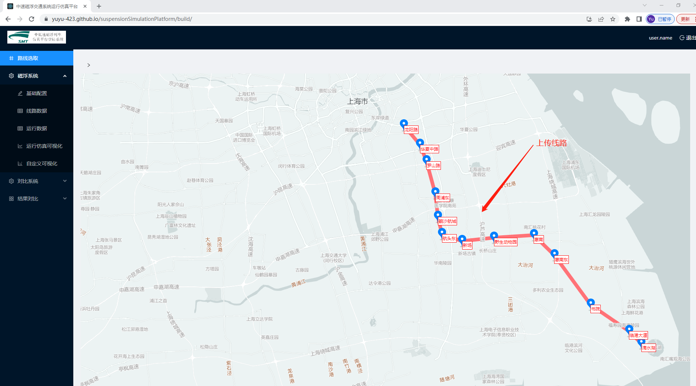

 ## 磁浮系统

### 基础配置

基础配置界面左上角为默认参数配置选项，选中默认参数配置选项是，基础配置界面的其他配置参数均不可进行数据输入，此时只需要点击右下角的“提交配置”按钮即可将配置数据提交，如图8所示。默认参数配置如表1所示。

***图7***

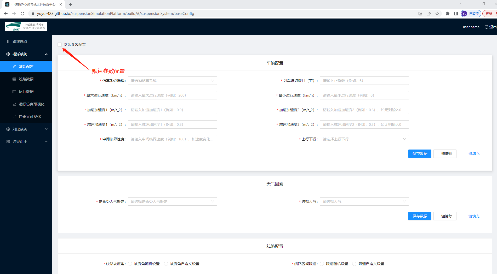

***图8***

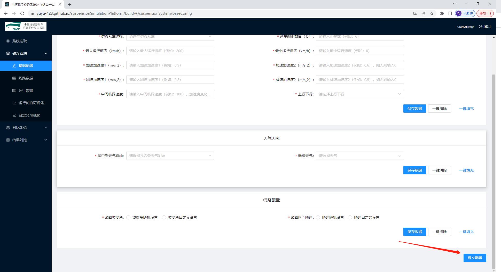

***表1 磁浮系统默认参数配置表***

| 配置名称       | 配置参数       | 配置名称     | 配置参数     |
| -------------- | -------------- | ------------ | ------------ |
| 仿真系统选择   | 磁浮系统       | 列车编组数目 | 8            |
| 最大运行速度   | 200            | 最小运行速度 | 0            |
| 加速加速度1    | 0.9            | 加速加速度2  | 0.9          |
| 减速加速度1    | 0.8            | 减速加速度2  | 0.5          |
| 中间临界速度   | 100            | 上行下行     | 下行         |
| 是否受天气影响 | 否             | 选择天气     | 晴           |
| 线路坡度角     | 坡度角随机设置 | 线路区间限速 | 限速随机设置 |

------

若不使用默认参数配置，用户自定义参数，在相应的下拉框或者输入框中选择或输入相应参数，进而达到仿真平台自定义的目的；除此以外，在仿真平台基础配置界面中提供“保存数据”、“一键清除”、“一键填充”三个按钮，方便用户进行基础数据的填充、局部数据的修改，在车辆配置、天气因素、线路配置相应配置完成后，点击相应的“保存数据”按钮即可将数据提交，在三部分数据填充完成并点击相应的“保存数据”按钮后，点击右下角的“提交配置”按钮即可将基础配置界面的输入数据进行提交。

***图9***

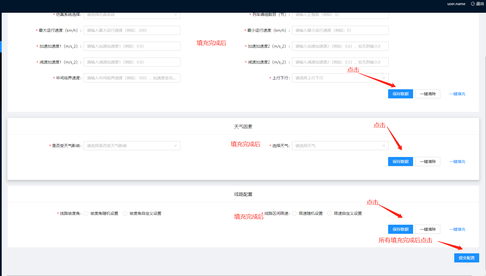

------

天气影响选项，仿真平台共提供两种选项，分别为“是”和“否”，若操作者选择“否”选项，则界面不会产生变化；若操作者选择“是”选项，则界面会自动弹出速度折扣系数输入表单，如图10所示；

***图10***

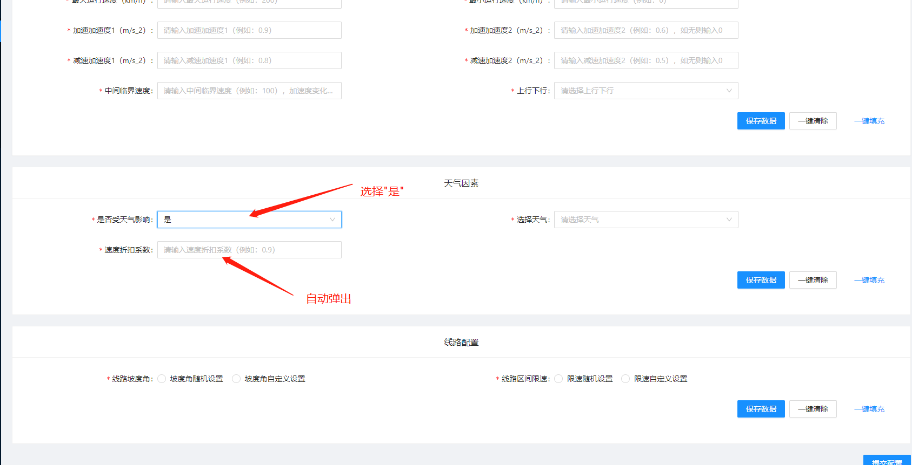

------

线路坡度角与线路区间限速两个表单选项，仿真平台提供坡度角与线路区间限速随机设置、自定义设置两种选项，若操作者选择随即设置选项，基础配置界面不会产生变化；若操作者选择自定义设置选项，则界面会根据上传线路及其划分轨道区间数目自动弹出各个轨道区段的坡度角自定义与限速自定义设置，如图11所示。

***图11***

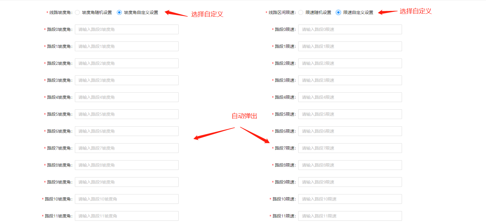

### 线路数据

1. 初始线路数据界面仅仅有数据表头，没有任何数据，在仿真平台中上传了线路数据、确定参数配置数据后，线路数据界面会自动填充完善。

------

2. 根据前面路线选取和基础配置界面传递的数据生成线路数据界面，同时仿真平台防止界面不能容下所有数据的情况，提供翻页、自定义单页数据数目功能（仿真平台默认单页显示8条数据），仿真平台提供单页数据数目5条/页、8条/页、10条/页、15条/页、20条/页、25条/页、30条/页共计7个选项，只需要操作者点击右下角分页功能处即可。

------

3. 同时仿真平台在线路数据界面提供单条数据编辑功能，只需点击每条数据后的编辑按钮即可进行数据编辑，操作者可自定义单条数据的各个参数配置，若保存单条数据配置点击“save”按钮即可，若取消编辑或不保存修改后的数据点击“cancel”按钮即可。

------

4. 线路数据界面提供线路数据下载功能，点击右下角下载标识即可对当前配置的线路数据进行excel表格本地下载，下载文件命名格式为“仿真配置数据.xlsx”。

5. 在线路数据确认无误没有修改时，点击线路数据界面右下角“确定仿真配置”按钮，即可将仿真配置数据进行提交。

   ***图12***

   

   ***图13***

   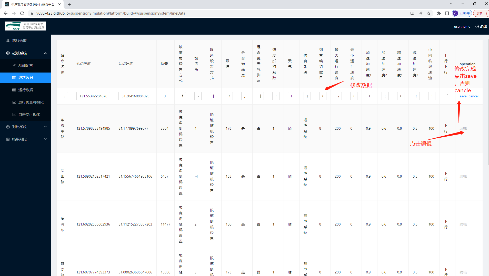

------

### 运行数据

------

1. 若初始没有传入线路数据以及提交仿真配置，运行数据界面的仿真路段选项仅仅有整条线路选项，若此时已经传入线路数据以及提交仿真配置，此时仿真路段选项除了整条线路以外还有线路站点间路段仿真选项，线路站点间路段仿真选项是由线路数据自动生成，若在线路选取界面使用在线编辑线路模式，则线路站点是根据英文字母生成。

------

2. 在仿真路段选择完成后，点击运行数据界面中的“一键仿真”按钮仿真平台即可对这个路段进行运行仿真，生成在这个路段的仿真数据，同时运行数据界面提供了分页、页面跳转功能，提供单页数据数目5条/页、8条/页、10条/页、15条/页、20条/页、25条/页、30条/页共计7个选项，运行数据界面默认10条/页。
3. 运行数据界面页提供了仿真后数据下载本地excel功能，点击页面右下角的下载符号即可进行仿真数据下载，下载数据命名格式为“仿真结果数据_仿真路段名称.xlsx”。

------

***图14***

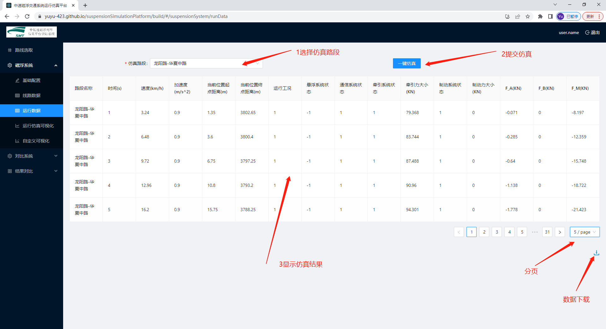

------

### 运行仿真可视化

共提供速度运行分析、加速度分析、当前位置距离起点距离分析、当前位置距离终点分析、运行工况分析、悬浮系统状态分析、通信系统状态分析、牵引系统状态分析、牵引力提供分析、制动系统状态分析、制动力提供分析、阻力分析、各个站点运行时间分析共计13个可视化分析，其中各个站点运行时间分析可视化只有在运行数据界面的仿真路段选择整条线路才能在运行仿真可视化界面显示，否则不显示。

***图15***

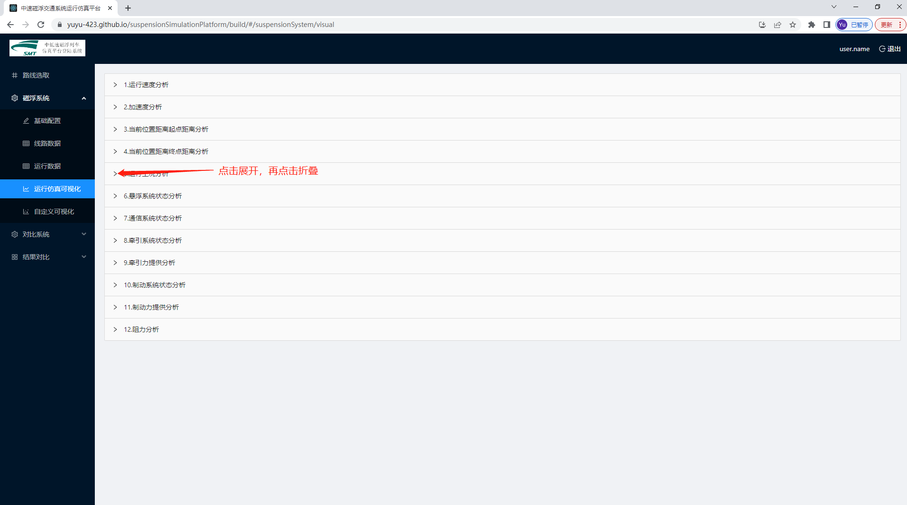

### 自定义可视化

1. 自定义可视化界面意义为操作者提供不局限于横轴数据为时间的可视化图像，除此以外，还为操作者提供最多在同一张绘图中显示四条曲线的绘图方式。点击“新建可视化”按钮可以在界面中新增可视化；点击红色删除按钮即可将该区域可视化删除掉。

2. 在自定义可视化界面中，通过点击“单线可视化”、“双线可视化”、“三线可视化”、“四线可视化”按钮即可绘制不同数量曲线的自定义可视化，其中x轴数据为时间、速度、加速度、距离起点距离、距离终点距离、运行工况、悬浮系统状态、通信系统状态、牵引系统状态、制动系统状态、牵引力、制动力、阻力F_A、阻力F_B、阻力F_M，当x轴数据选取某个选项时，在后面的y数据选项中便不会出现x轴选择数据选项，以此类推，防止发生重合。

   除此以外绘制区域以及配置区域提供折叠面板功能，绘制区域名称会随着选择的x轴数据和y轴数据名称而发生改变。

***图16***

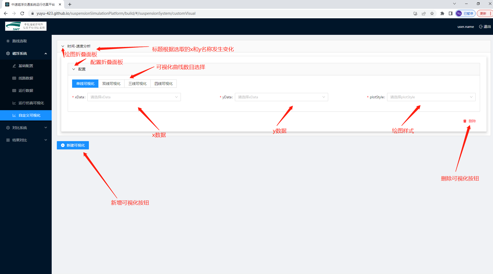

------

## 对比系统

对比系统共包括5个子项目操作界面，分别是基础配置子项目界面、线路数据子项目界面、运行数据子项目界面、运行仿真可视化子项目界面、自定义可视化子项目界面。上述五个界面与磁浮系统中五个界面类似。

对比系统的基础配置界面的仿真系统选择共有三个选项，分别是轻轨系统、地铁系统、高铁系统，而磁浮系统中的基础配置界面的仿真系统选择只有一个选项，为磁浮系统。对比系统的默认参数配置如表4.4所示。

表2 对比系统默认参数配置表

| 配置名称       | 配置参数       | 配置名称     |   配置参数   |
| -------------- | -------------- | ------------ | :----------: |
| 仿真系统选择   | 地铁系统       | 列车编组数目 |      8       |
| 最大运行速度   | 120            | 最小运行速度 |      0       |
| 加速加速度1    | 0.9            | 加速加速度2  |     0.6      |
| 减速加速度1    | 0.8            | 减速加速度2  |     0.5      |
| 中间临界速度   | 80             | 上行下行     |     下行     |
| 是否受天气影响 | 否             | 选择天气     |      晴      |
| 线路坡度角     | 坡度角随机设置 | 线路区间限速 | 限速随机设置 |

## 结果对比

### 数据对比

选择仿真系统、路段（站点）名称、路段距离、行驶时间、限速、最大速度、最小速度、平均速度、平均旅行速度、最大加速度、最小加速度、最大牵引力、最小牵引力、牵引状态、悬浮状态、通信系统状态、制动系统状态、运行工况、最大制动力、最小制动力、最大阻力F_A、最小阻力F_A、最大阻力F_B、最小阻力F_B、最大阻力F_M、最小阻力F_M共计26个对比指标进行磁浮系统和对比系统之间的结果对比。在前方线路数据配置、磁浮系统参数配置、磁浮系统路段仿真、对比系统参数配置、对比系统路段仿真完成后，数据对比界面的对比表格会自动生成，同时仿真平台数据对比界面提供对比数据下载功能，点击数据对比界面右下角的下载按钮即可下载为本地excel文件，下载文件命名为“对比结果数据_路段名称.xlsx”。

***图17***

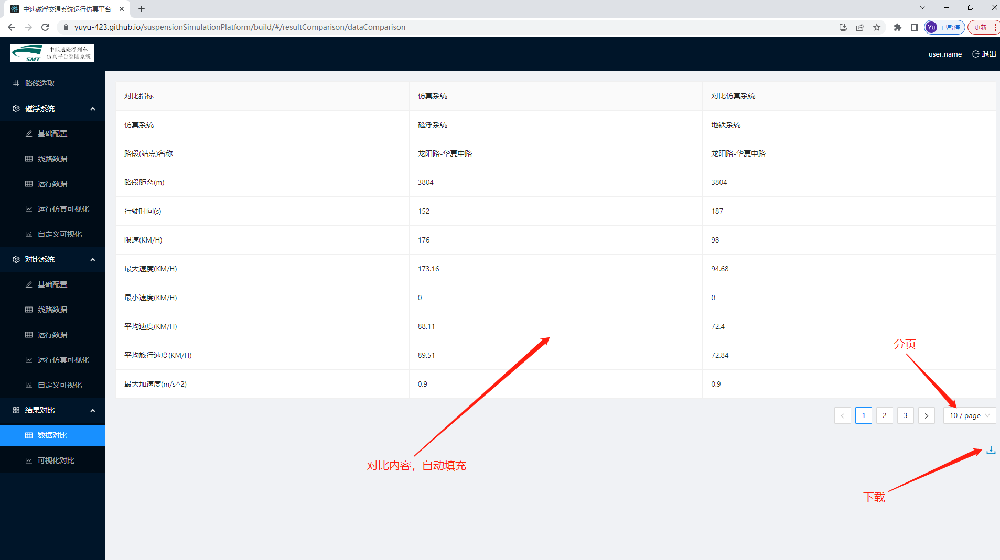

### 可视化对比

提供速度运行对比分析、加速度对比分析、当前位置距离起点距离对比分析、当前位置距离终点对比分析、运行工况对比分析、通信系统状态对比分析、牵引系统状态对比分析、牵引力提供对比分析、制动系统状态对比分析、制动力提供对比分析、F_A阻力对比分析、F_B阻力对比分析、F_M阻力对比分析、各个站点运行时间对比分析共计14个可视化分析，其中各个站点运行时间对比分析可视化只有在运行数据界面的仿真路段选择整条线路才能在运行仿真可视化界面显示，否则不显示，点击各个可视化左侧的“>”即可打开可视化折叠面板，查看可视化情况，再次点击即可折叠面板。

***图18***

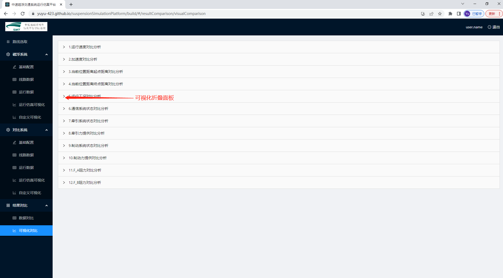
